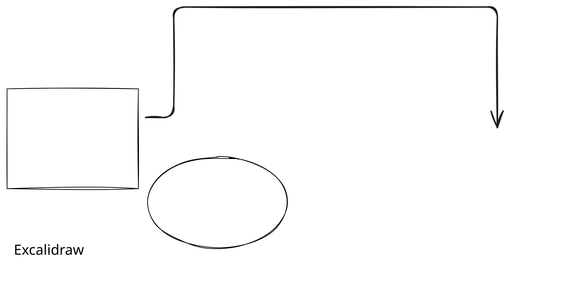
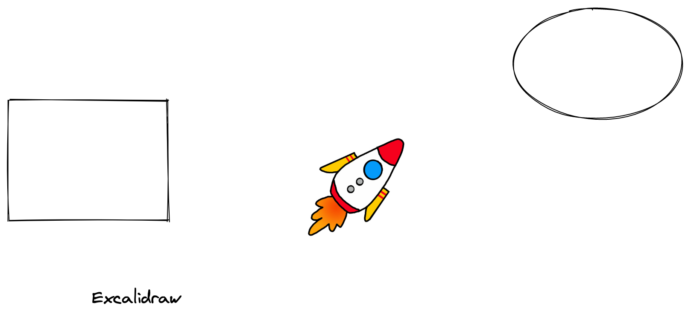

# VS Code compatibility examples

These files are unchanged copies of `examples/test.excalidraw.svg` and
`examples/test.excalidraw.png` from [excalidraw-vscode at commit
06bb63c](https://github.com/excalidraw/excalidraw-vscode/tree/06bb63cea9b52d4759fc16606e95f48c0accf14c/examples).
The upstream MIT license is included in this directory.

Copy these files before editing them; browser compatibility tests use the originals.
Open a copy in the IDE, edit a shape, save, then reopen it. Its image preview and
editable shapes should both reflect the change.

